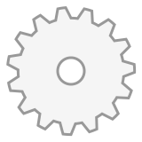
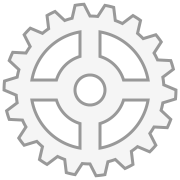
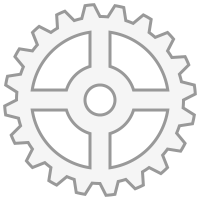
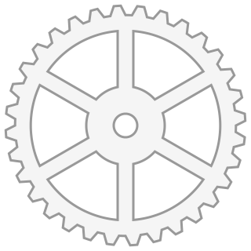
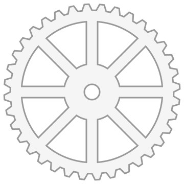
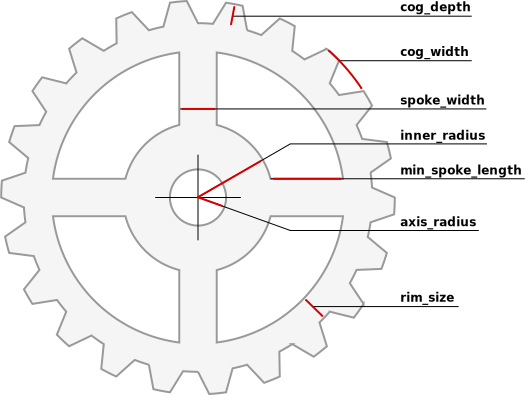

# Gear.svg

Procedurally generate cogwheels with a given number of cogs and spokes.

Examples generated by [make_gears.py](make_gears.py)



## Using [gear.py](gear.py) to generate more SVGs

```
from gear import gear
```

Call `gear` function with the number of cogs and spokes:

```
output = gear(15) # 15 cogs
output = gear(25, 3) # 25 cogs and 3 spokes
```

The function returns SVG content as a string. To save it to a file use `file_name` parameter:

```
gear(15, file_name='my_gear15.svg')
gear(25, 3, file_name='my_gear25.svg')
```

To change the color of the gears, use `style` parameter containing SVG [style](https://developer.mozilla.org/en-US/docs/Web/SVG/Attribute/style) options:

```
gear(15, style='stroke:none;fill:black', file_name='black_gear.svg')
```

All function parameters and their default values:

```
def gear(
        # gear parameters
        cogs = 20,
        spokes = 4,

        #style
        style = 'stroke:#000;stroke-width:2;fill:#ddd',
        
        # geometry parameters
        margin = 5,
        cog_width = 15,
        cog_depth = 12,
        axis_radius = 15,
        inner_radius = 35,
        rim_size = 15,
        spoke_width = 20,
        min_spoke_length = 20,

        # output and debug parameters
        file_name = None,
        draw_grid = False
    )
```

Geometry options explained in the image below:



Notes:

* `cog_width` is the distance between two ajdacent cogs in pixels along the circumference.
* The radius of the gear is calculated from the number of `cogs` and `cog_width`.
* The size of the SVG image is calculated to accommodate the gear plus the `margin` around it. The SVG size is rounded up to the neatest 10px.
* Spokes won't be rendered if the gear is too small to accommodate spokes of at least `min_spoke_length`
